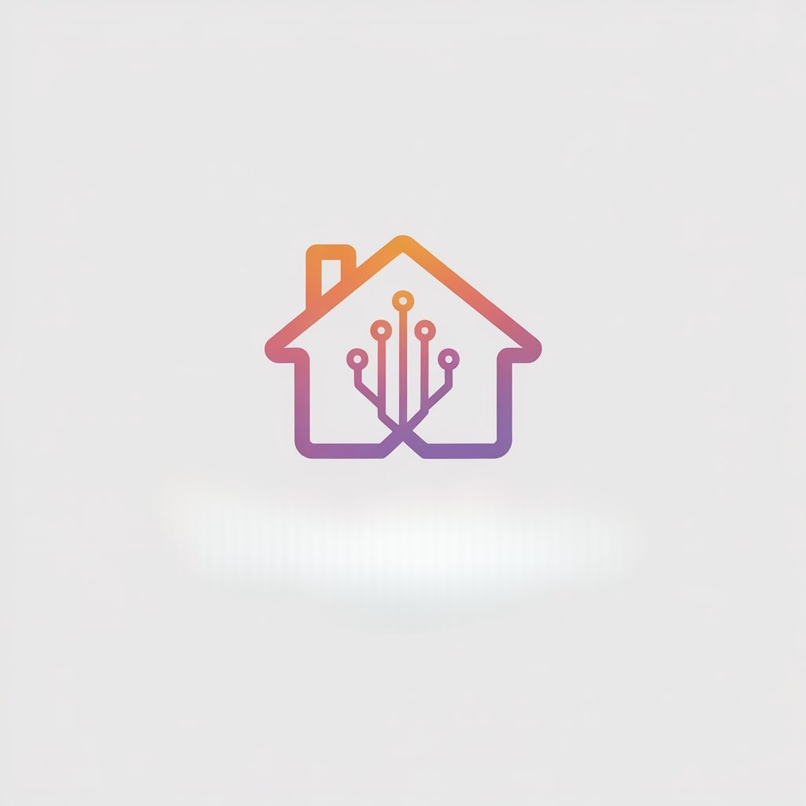

# Hackathon-Dev-de-Impacto

# Lar Justo

  

<i>Representante digital do cidadão vulnerável</i>

#

## Team Members

  <table>
    <tr>
      <td align="center">
        <a href="https://www.linkedin.com/in/david-deodato/">
           
          <b>David Deodato</b>
        </a>
      </td>
      <td align="center">
        <a href="https://www.linkedin.com/in/llorengarcia/">
           
          <b>Lorena Garcia</b>
        </a>
      </td>
      <td align="center">
        <a href="https://www.linkedin.com/in/lavinia-mendonca/">
           
          <b>Lavínia Mendonça</b>
        </a>
      </td>
    </tr>
  </table>

## Descrição  

O **Lar Justo** é uma plataforma digital de **inteligência artificial empática** criada para **garantir o direito à moradia digna** e reduzir a exclusão digital e burocrática no acesso a serviços públicos.  
A solução atua como um **representante digital de direitos**, que acompanha cidadãos em situação de vulnerabilidade habitacional — desde o recebimento de uma notificação de despejo até o encaminhamento à Defensoria Pública ou Secretaria de Habitação.  

Por meio de uma interface simples, inclusiva e acessível por voz, o Lar Justo **traduz juridiquês em linguagem humana**, organiza provas, gera documentos oficiais e acompanha prazos automaticamente.  

**[>> Acesse o vídeo demo do projeto AQUI <<](https://drive.google.com/file/d/1hJQIJXGkipL9sOwm_O3_qHIpd2iZJpLP/view?usp=sharing)**  

---

## Problema Resolvido  

No Brasil, mais de **14 milhões de famílias** vivem em déficit habitacional e cerca de **500 mil pessoas** enfrentam risco direto de despejo ou desabamento.  
Grande parte dessas famílias não possui **acesso à informação, orientação jurídica ou ferramentas digitais** para entender e reivindicar seus direitos.  

O **Lar Justo** resolve essa lacuna ao:  
- Traduzir notificações e documentos oficiais em **linguagem simples e empática**;  
- **Automatizar a geração de cartas e requerimentos** formais;  
- **Acompanhar casos de forma contínua**, evitando o abandono burocrático;  
- Reduzir a dependência de deslocamento e intermediários para acessar o Estado.  

> **Em síntese:** o projeto transforma a burocracia em acolhimento e o juridiquês em clareza, garantindo que o cidadão seja ouvido, compreendido e acompanhado.  

---

## Tecnologia  

A arquitetura do **Lar Justo** é **serverless, modular e acessível**, construída com tecnologias modernas e sustentáveis:  

| **Camada** | **Tecnologia** | **Função Principal** |
|-------------|----------------|----------------------|
| **Frontend** | Next.js 15 + React + Tailwind + shadcn/ui | Interface responsiva, acessível e mobile-first. |
| **Backend** | Next.js API Routes + Server Actions | Lógica de negócios, integração e controle da IA. |
| **Banco de Dados** | PostgreSQL (Neon) + Prisma ORM | Armazenamento estruturado e vetorizado de dados. |
| **IA (NLP e Visão)** | OpenAI GPT-4o / GPT-4o-mini | OCR, classificação de documentos, RAG, geração de textos e voz. |
| **Vetorização** | pgvector | Busca semântica e contextualização de informações. |
| **Infraestrutura** | Vercel (frontend e backend) + Neon Cloud | Deploy serverless, CI/CD automático e baixo custo operacional. |
| **Áudio e Acessibilidade** | Web Speech API (STT/TTS) + OpenAI TTS | Interação por voz e leitura automática para inclusão digital. |
| **Notificações** | Webhooks + Telegram / e-mail | Acompanhamento de prazos e status de casos em tempo real. |

---

## Características-Chave  

| **Categoria** | **Descrição** |
|----------------|----------------|
| 💬 **IA Empática e Multimodal** | IA com linguagem humanizada e suporte a texto, voz e, futuramente, vídeo (para leitura de gestos e expressões). |
| 🧠 **Raciocínio Contextual (RAG)** | A IA entende o contexto jurídico e social do caso, oferecendo respostas precisas e personalizadas. |
| 🧾 **OCR e Geração de Documentos Automática** | Leitura de notificações, classificação de tipo de caso e criação de cartas prontas para Defensorias. |
| 🕒 **Acompanhamento Ativo e Timeline Visual** | Linha do tempo interativa com etapas, prazos e lembretes automáticos. |
| 📍 **Geolocalização e Acesso Territorial** | Identificação dos serviços públicos mais próximos (CRAS, Defensoria, Habitação). |
| 🧏 **Acessibilidade e Inclusão Digital** | Uso de voz, tradução PT↔ES e interface simples para pessoas com baixo letramento digital. |
| 🧩 **Painel Institucional** | Dashboard para Defensorias, CRAS e ONGs acompanharem métricas e impactos sociais. |
| 🔒 **Segurança e LGPD** | Armazenamento anonimizado e criptografado, com total conformidade à LGPD. |

---

> **Em essência:** o **Lar Justo** é a união entre tecnologia, empatia e cidadania — uma IA que não apenas orienta, mas **permanece ao lado do cidadão até o recomeço.**

